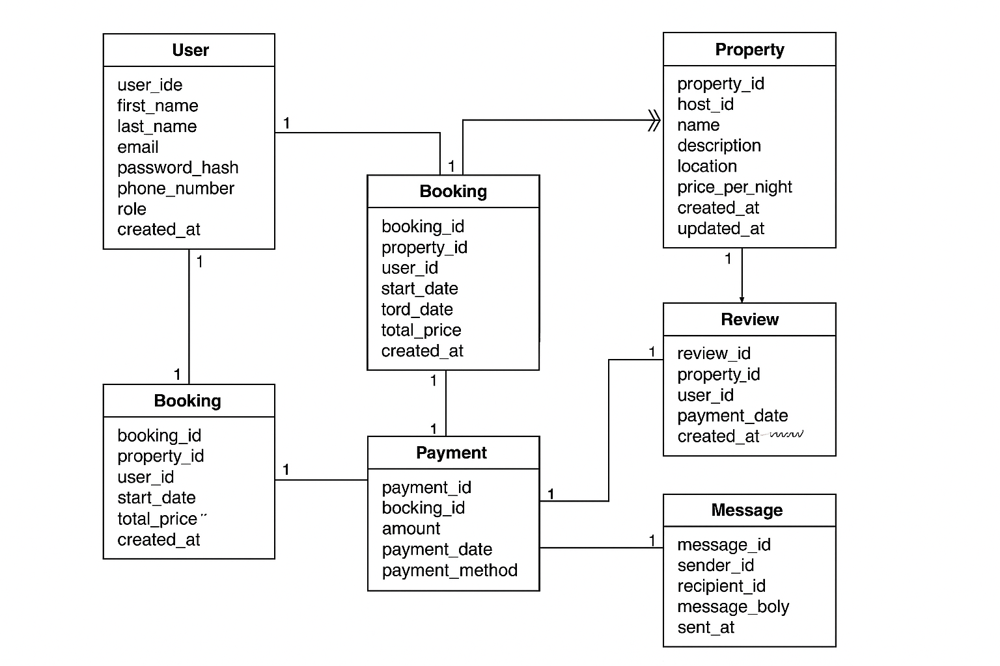

## Entity-Relationship (ER) Diagram

The ER diagram below shows the main entities and relationships in the **Airbnb-style booking database**.  
It represents how users, properties, bookings, payments, reviews, and messages are connected.  
This visual helps understand the database structure before moving on to normalization and schema design.

